# Prodigy Custom Theme Screencaps

See: https://prodi.gy/docs/api-web-app#themes for options## `accept` 

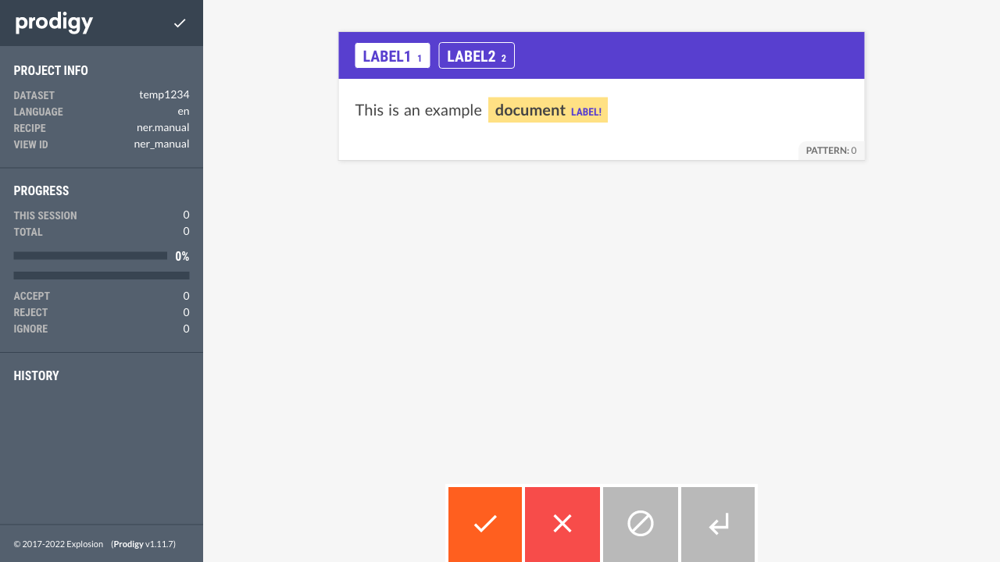

## `reject` 

## `ignore` 

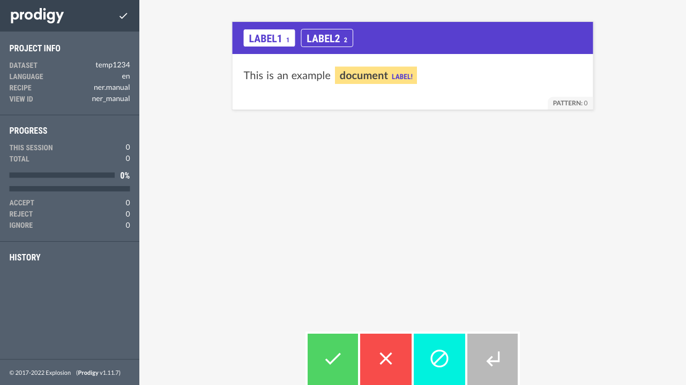

## `undo` 

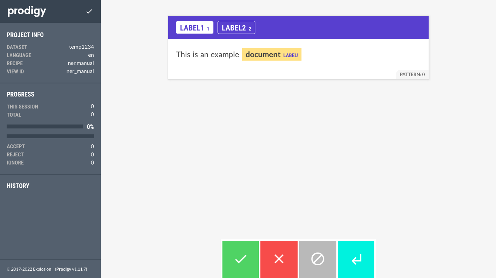

## `colorButton` 

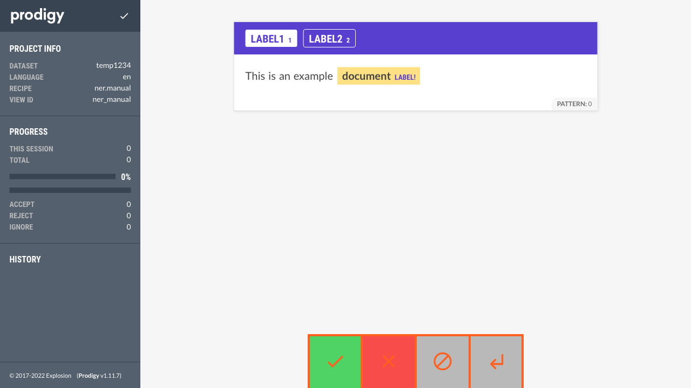

## `bgCard` 

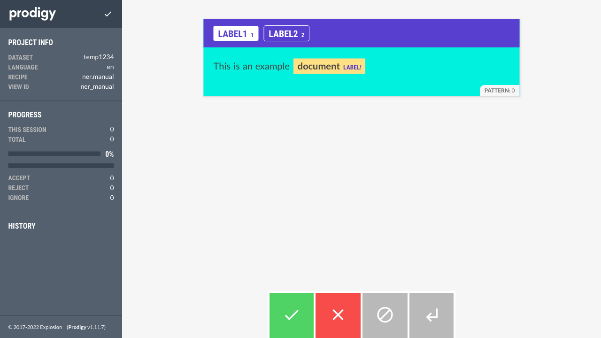

## `bgCardSecondary` 

## `bgCardTertiary` 

## `bgCardQuaternary` 

## `bgPage` 

## `bgSidebar` 

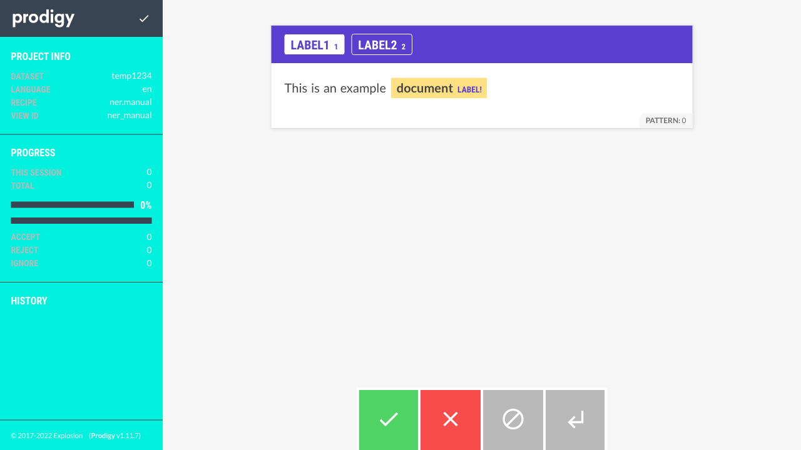

## `bgSidebarDark` 

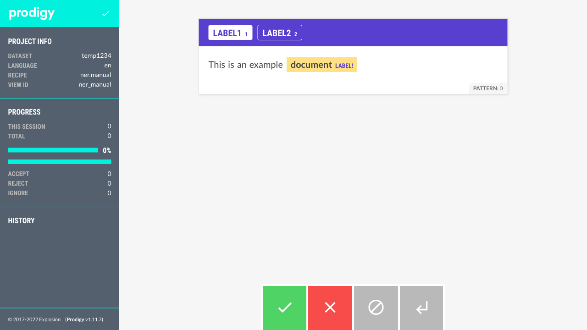

## `bgHighlight` 

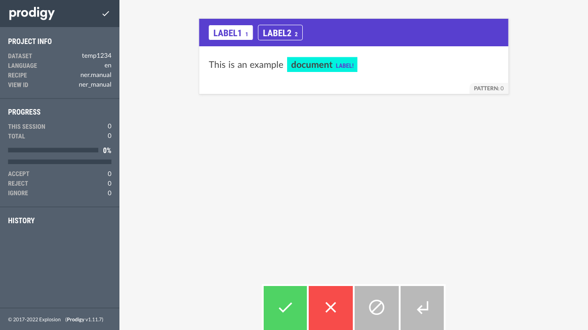

## `bgLowlight` 

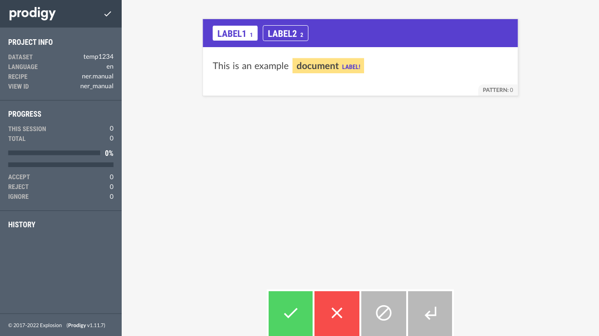

## `bgCardTitle` 

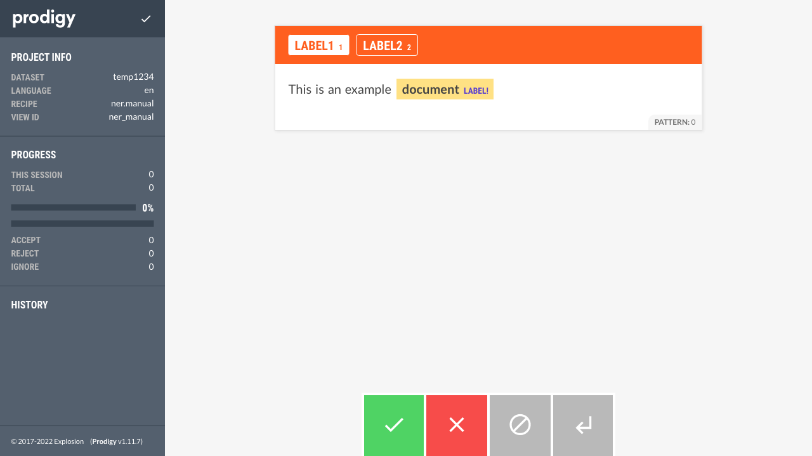

## `bgProgress` 

## `bgButton` 

## `bgMeta` 

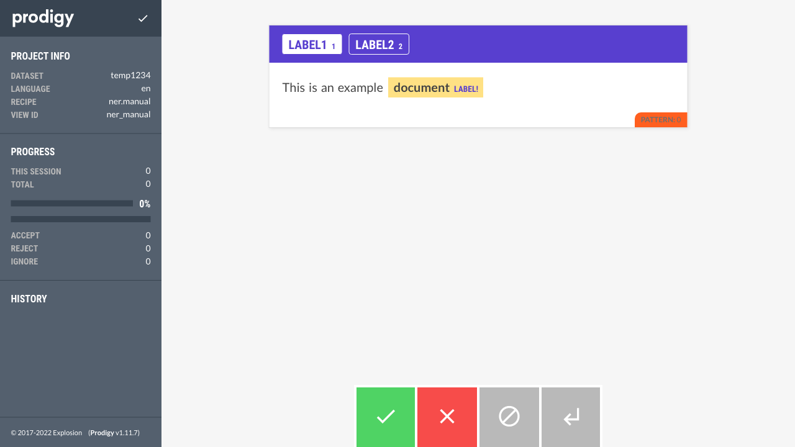

## `colorText` 

## `colorMeta` 

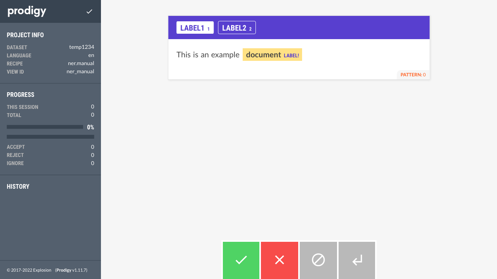

## `colorMessage` 

## `colorSidebar` 

## `colorSidebarHeadline` 

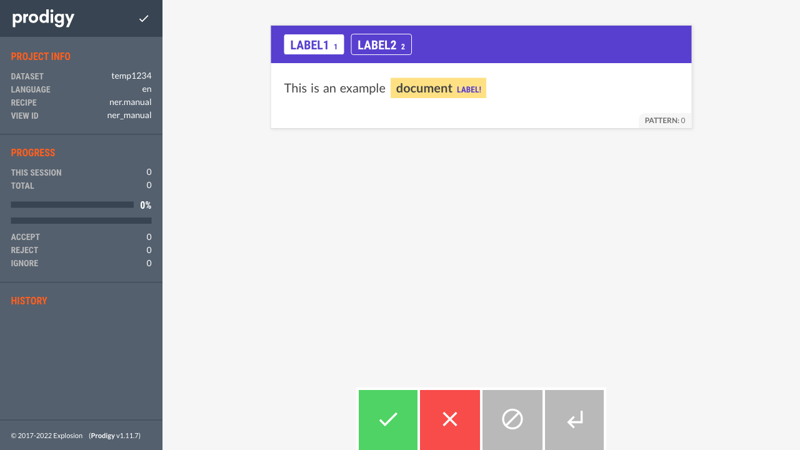

## `colorSidebarLabel` 

## `colorHighlightLabel` 

## `colorCardTitle` 

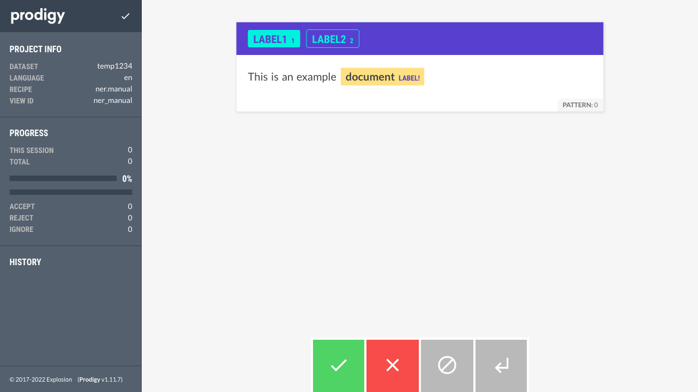

