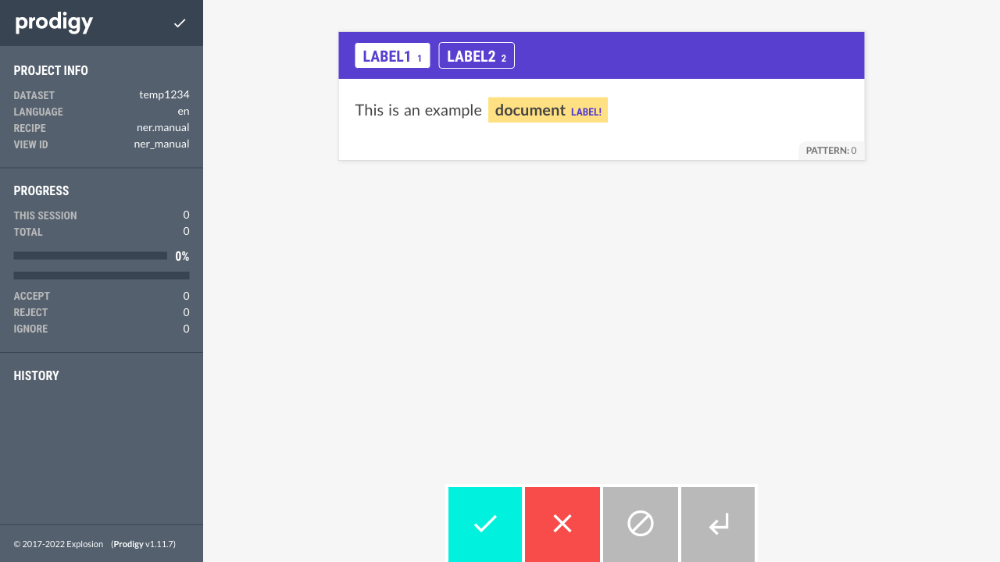
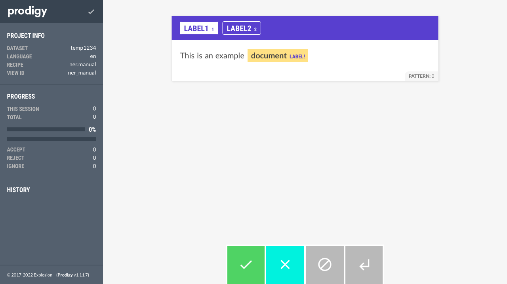
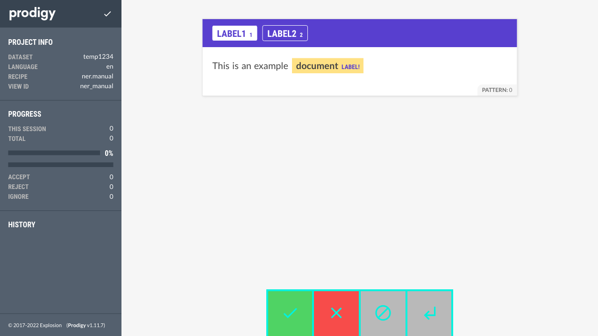
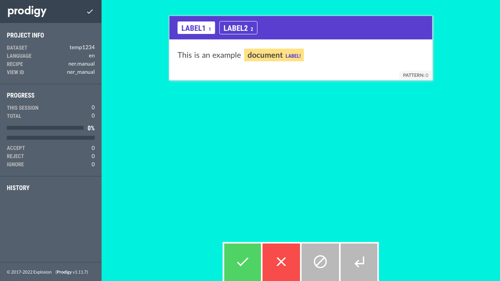
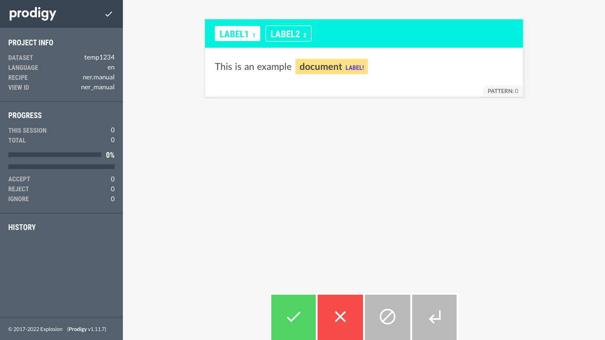
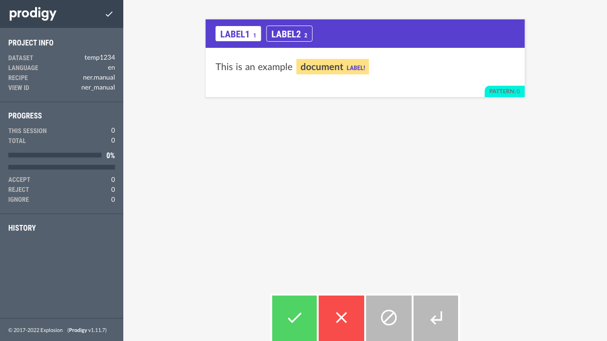
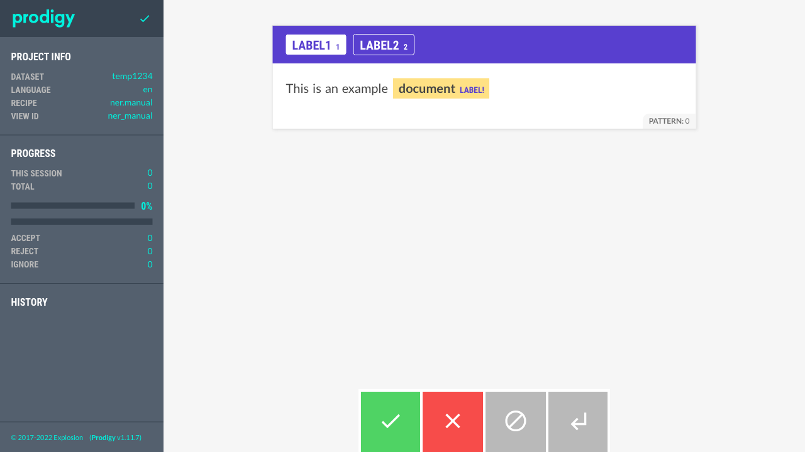

# Prodigy Custom Theme Screencaps

See: https://prodi.gy/docs/api-web-app#themes for options## `accept` 

## `reject` 

## `ignore` 

## `undo` 

## `colorButton` 

## `bgCard` 

## `bgCardSecondary` 

## `bgCardTertiary` 

## `bgCardQuaternary` 

## `bgPage` 

## `bgSidebar` 

## `bgSidebarDark` 

## `bgHighlight` 

## `bgLowlight` 

## `bgCardTitle` 

## `bgProgress` 

## `bgButton` 

## `bgMeta` 

## `colorText` 

## `colorMeta` 

## `colorMessage` 

## `colorSidebar` 

## `colorSidebarHeadline` 

## `colorSidebarLabel` 

## `colorHighlightLabel` 

## `colorCardTitle` 

